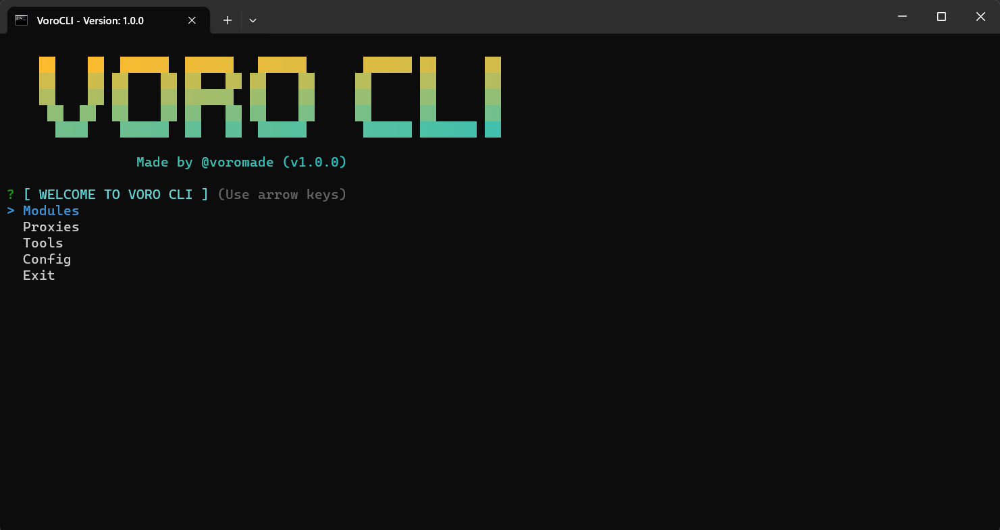

## Made by [voromade](https://github.com/voromade)

<h1 align="center">✨ Voro CLI ✨</h1>
<h4 align="center">⭐ Leave a star for more! ⭐</h4>

<p align="center">
  
</p>

## Commands:

#### **Install Dependencies**

```
npm install or yarn add
```

#### **Serve For Development**

```
npm start or yarn start
```

#### **Build for production**

```
npm build or yarn build
```

## Features

- California Pizza Kitchen Free Food Module (Requests)
- Krispy Kreme Free Donut Module (Requests)
- eBay View Bot (Requests)
- Mercari View Bot (Requests)
- OfferUp View Bot (Requests)
- Twitter Account Generator (Requests)
- GMAIL Account Generator (Browser)
- Shopify Account Generator (Requests)
- Walmart Account Generator (Requests)
- Target Account Generator (Browser)
- eBay Account Generator (Browser)
- Outlook Account Generator (Requests)
- Spoof Browser
- Proxy Support
- IMAP Support
- 5sim Integration
- Multiple Captcha Provider Integrations

## License

This software is licensed under the MIT License. See LICENSE.md for more details.
